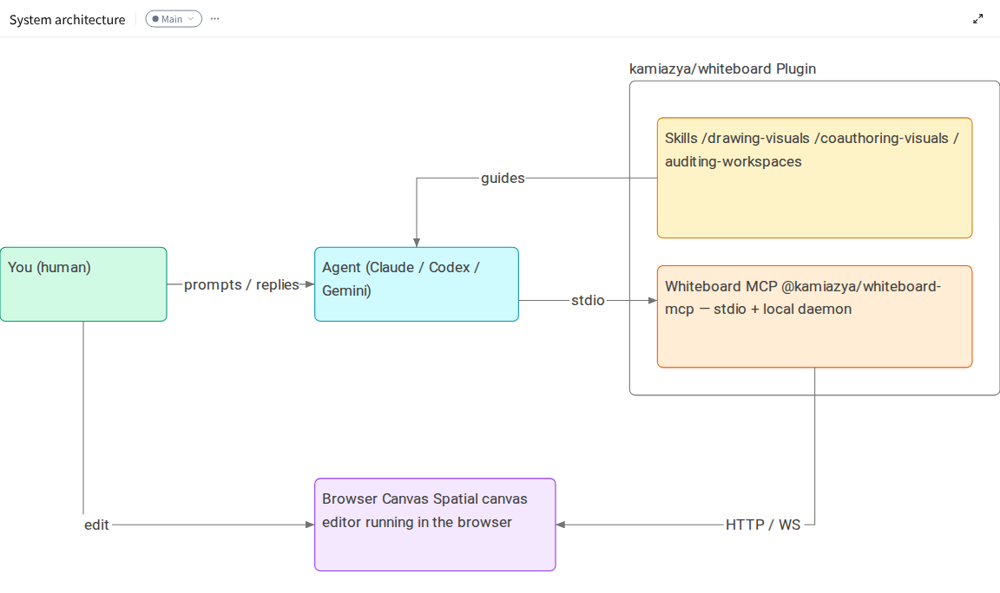
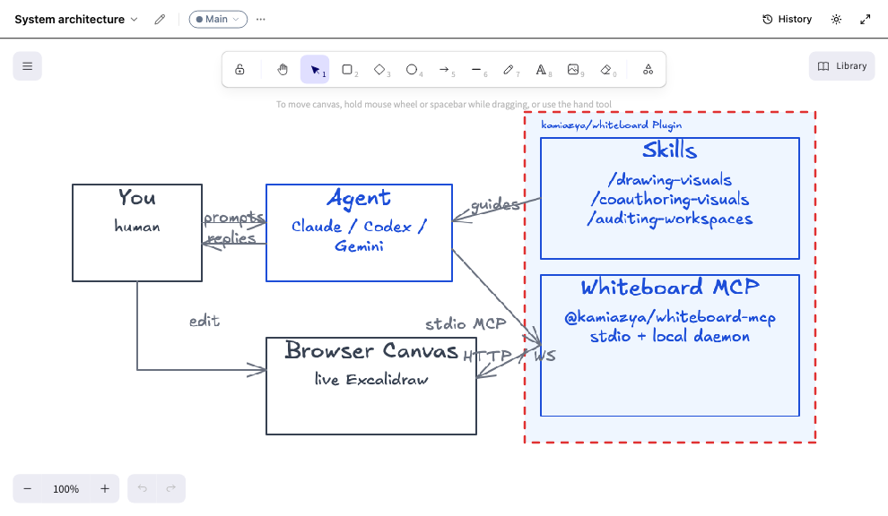
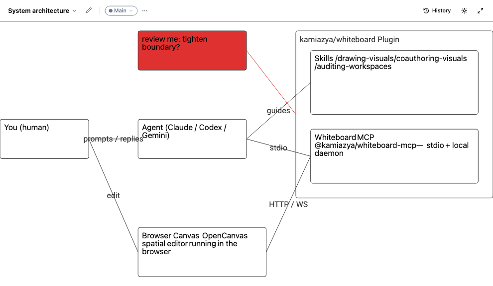
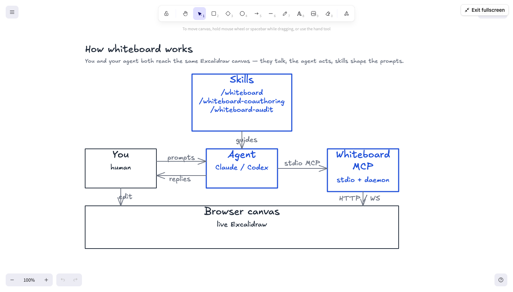
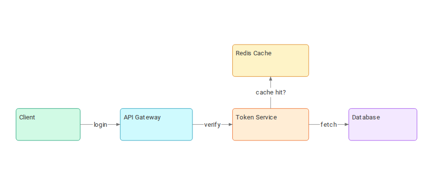

# @kamiazya/whiteboard

> A collaborative Excalidraw canvas for Claude Code, Codex, and Gemini CLI. Draw with your AI agent to align on specs, architecture, and workflows — directly on a shared real-time whiteboard.

[](https://www.npmjs.com/package/@kamiazya/whiteboard-mcp)
[](LICENSE)
[](https://github.com/kamiazya/whiteboard/actions/workflows/ci.yml)

## Start here

whiteboard is a **browser-first whiteboard that grows with you**: open a canvas in
your browser, run it locally for durable private storage, and self-host it for a
team when you're ready.

**Try it in your browser** — no account; your canvas data stays in your own
browser. <sub>*Browser-local: runs in your browser, data stays on your machine.*</sub>
*[Get started →](docs/tutorials/getting-started.md) — runs locally from a checkout today.*

### ▶ Draw with your AI agent

The fastest way to get value today. Claude Code, Codex, or Gemini draw on the
canvas alongside you over MCP. <sub>*Local daemon: a server on your own machine.*</sub>

**→ [Get started: Quick install](#quick-install)**

---

**Self-host for your team** — run whiteboard as a shared server behind your own
identity provider and TLS. <sub>*Server mode: a shared server you operate.*</sub>
→ [Self-host with Docker](docs/how-to/self-host-with-docker.md)

## How whiteboard works

You and your agent both reach the same Excalidraw canvas — they talk, the agent acts, skills shape the prompts. The `kamiazya/whiteboard` plugin packages three skills and a Whiteboard MCP server together; the agent calls MCP tools via stdio and the daemon syncs the canvas to your browser over WebSocket.

<p align="center">
  
  <br />
  <sub><i>Diagram drawn with whiteboard itself — see <a href="docs/assets/architecture.excalidraw">architecture.excalidraw</a> to open it in Excalidraw and remix.</i></sub>
</p>

`@kamiazya/whiteboard-mcp` runs a live Excalidraw canvas in your browser and exposes MCP tools so Claude Code, Codex, Gemini CLI, or any MCP-capable agent can draw, annotate, and refine diagrams alongside you. Canvases live locally under `~/.whiteboard/`, sync over WebSocket, and round-trip with stock `.excalidraw` JSON.

<p align="center">
  
</p>

## Reach for whiteboard when…

- **You're aligning with your agent on a design and text alone keeps drifting.** Sketch the request flow once, ask the agent to fill in the missing edges, point at the diagram instead of re-explaining.
- **You're reviewing a change and want to mark up the architecture together.** Open an existing workspace, ask the agent to add the new path, compare against the previous frame, export a PNG for the PR description.
- **You're writing docs or onboarding material and want a reusable diagram.** Drive the agent to produce the diagram, save the `.excalidraw`, drop the PNG into the doc — open it again later in [excalidraw.com](https://excalidraw.com) when something needs updating.

| Aligning on a design | Reviewing and marking up | Presenting or sharing |
|:---:|:---:|:---:|
|  |  |  |
| **Agent drew it** — you guided the layout | **You annotated it** — review notes on the canvas | **Fullscreen mode** — clean export for docs |

The same workflow works across any scenario — the agent draws boxes, arrows, and labels on a fresh canvas:

<p align="center">
  
  <br />
  <sub><i>Auth service flow drawn by the agent — numbered steps, cache callout, color-coded components.</i></sub>
</p>

## Quick install

### Claude Code

In a Claude Code session, run:

```
/plugin marketplace add kamiazya/whiteboard
/plugin install whiteboard@whiteboard-marketplace
```

This installs the MCP server **and** the bundled `/drawing-visuals`, `/coauthoring-visuals`, and `/auditing-workspaces` skills in one step.

<details>
<summary>MCP only (no skills)</summary>

```bash
claude mcp add whiteboard -- npx -y @kamiazya/whiteboard-mcp@latest
```

> Starts the MCP server only — the `/drawing-visuals`, `/coauthoring-visuals`, and `/auditing-workspaces` skills are **not** installed this way. [Link them manually →](docs/contributing/development.md#bundled-skills-install)

</details>

### Codex

In a Codex session, run:

```
codex plugin marketplace add kamiazya/whiteboard@stable
```

The `@stable` pin tracks the latest release instead of the development branch.

Then open `/plugins`, choose **kamiazya Whiteboard → whiteboard → Install plugin**, and restart Codex. This installs the MCP server **and** the bundled skills in one step.

<details>
<summary>MCP only (no skills)</summary>

Add to `~/.codex/config.toml`:

```toml
[mcp_servers.whiteboard]
command = "npx"
args = ["-y", "@kamiazya/whiteboard-mcp@latest"]
```

> Starts the MCP server only — the `/drawing-visuals`, `/coauthoring-visuals`, and `/auditing-workspaces` skills are **not** installed this way. [Link them manually →](docs/contributing/development.md#bundled-skills-install)

</details>

### Gemini CLI

```bash
gemini extensions install https://github.com/kamiazya/whiteboard
```

<details>
<summary>MCP only (no extension)</summary>

Add to `~/.gemini/settings.json`:

```json
{
  "mcpServers": {
    "whiteboard": {
      "command": "npx",
      "args": ["-y", "@kamiazya/whiteboard-mcp@latest"]
    }
  }
}
```

> Starts the MCP server only — the `/drawing-visuals`, `/coauthoring-visuals`, and `/auditing-workspaces` skills are **not** installed this way. [Link them manually →](docs/contributing/development.md#bundled-skills-install)

</details>

### Verify

In your agent session, ask it to call `canvas_create({ slug: "smoke" })`. The first call opens a Chromium tab pointed at the canvas and creates `~/.whiteboard/{workspaceId}/`.

## Bundled skills

Three opinionated `SKILL.md` packs ship inside the npm package. The recommended **plugin install above wires them up automatically** — no manual linking. If you instead used `claude mcp add`, the Codex CLI snippet, or `npx`, link them yourself per [docs/contributing/development.md#bundled-skills-install](docs/contributing/development.md#bundled-skills-install).

| Skill | When to use |
|---|---|
| `/drawing-visuals` | When screen layout, structure, flow, or comparison still feels too ambiguous in text alone — start drawing on the canvas together. |
| `/coauthoring-visuals` | A structured loop for evolving visuals with the agent: gather context, structure frame by frame, run fresh-viewer tests on what you draw. |
| `/auditing-workspaces` | Audit existing workspaces — detect orphaned workspaces, tombstone-heavy canvases, and cache/disk mismatches; report cleanup candidates. |

## Example transcript

```text
You    Use whiteboard to sketch the request flow for our auth service:
       client → API gateway → token service → DB. Highlight where caching lives.

Agent  cid = canvas_create({ slug: "auth-flow" }).id
       annotate_batch({ canvasId: cid, annotations: [ /* 4 service boxes + arrows */ ] })
       annotate({ canvasId: cid, type: "text",
                  target: { x: 240, y: 360 },
                  text: "cache lives here" })
       export_png({ canvasId: cid })

       Drew a 4-stage flow on the auth-flow canvas. Cache callout placed
       between API gateway and token service. PNG attached.
```

The agent returns the `export_png` result as an MCP `ImageContent`, so the next turn can reason about what was actually drawn — closing the loop between prompt and pixels.

## Documentation

| Topic | Where |
|---|---|
| Local checkout, HTTP MCP development loop, repo-local config override, skill linking | [docs/contributing/development.md](docs/contributing/development.md) |
| Environment variables, storage layout, Codex sandbox quirks | [docs/reference/configuration.md](docs/reference/configuration.md) |
| Components, data flow, MCP tool surface, design boundaries | [docs/explanation/architecture.md](docs/explanation/architecture.md) |
| Custom template fragment JSON format used by `template_insert` | [docs/reference/templates.md](docs/reference/templates.md) |
| MCP debugging workflow (Inspector, `MCP_HTTP_DEBUG`, transport checks) | [docs/contributing/mcp-debugging.md](docs/contributing/mcp-debugging.md) |
| Token-gated local HTTP, daemon trust model | [docs/explanation/security-model.md](docs/explanation/security-model.md) |
| WebSocket message shapes between daemon and browser | [docs/contributing/architecture/wire-protocol.md](docs/contributing/architecture/wire-protocol.md) |
| Test layers, commit conventions, release process | [CONTRIBUTING.md](CONTRIBUTING.md) |

## Limitations

- Live drawing and PNG export require a Chromium browser tab connected over WebSocket.
- The published transport is `stdio`. The HTTP MCP endpoint (`pnpm mcp:http:dev`) is for local development.

See [docs/reference/configuration.md](docs/reference/configuration.md#codex-sandbox-constraints) for sandbox quirks.

## License

[MIT](LICENSE)
