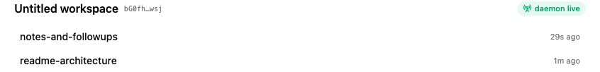
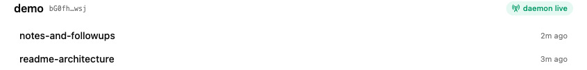

# @kamiazya/whiteboard

> A collaborative Excalidraw canvas for Claude Code and Codex. Draw with your AI agent to align on specs, architecture, and workflows — directly on a shared real-time whiteboard.

[](https://www.npmjs.com/package/@kamiazya/whiteboard-mcp)
[](LICENSE)
[](https://github.com/kamiazya/whiteboard/actions/workflows/ci.yml)

<p align="center">
  
  <br />
  <sub><i>Diagram drawn with whiteboard itself — see <a href="docs/assets/architecture.excalidraw">architecture.excalidraw</a> to open it in Excalidraw and remix.</i></sub>
</p>

`@kamiazya/whiteboard-mcp` runs a live Excalidraw canvas in your browser and exposes MCP tools so Claude Code, Codex, or any MCP-capable agent can draw, annotate, and refine diagrams alongside you. Canvases live locally under `~/.whiteboard/`, sync over WebSocket, and round-trip with stock `.excalidraw` JSON.

## Reach for whiteboard when…

- **You're aligning with your agent on a design and text alone keeps drifting.** Sketch the request flow once, ask the agent to fill in the missing edges, point at the diagram instead of re-explaining.
- **You're reviewing a change and want to mark up the architecture together.** Open an existing workspace, ask the agent to add the new path, compare against the previous frame, export a PNG for the PR description.
- **You're writing docs or onboarding material and want a reusable diagram.** Drive the agent to produce the diagram, save the `.excalidraw`, drop the PNG into the doc — open it again later in [excalidraw.com](https://excalidraw.com) when something needs updating.

## Quick install

### Claude Code — plugin (recommended)

In a Claude Code session, run:

```
/plugin marketplace add kamiazya/whiteboard
/plugin install whiteboard@whiteboard-marketplace
```

This installs the MCP server **and** the bundled `/whiteboard`, `/whiteboard-coauthoring`, and `/whiteboard-audit` skills in one step.

### Claude Code — MCP only

If you only want the MCP server (no slash skills):

```bash
claude mcp add whiteboard -- npx -y @kamiazya/whiteboard-mcp@latest
```

### Codex CLI

Add to `~/.codex/config.toml`:

```toml
[mcp_servers.whiteboard]
command = "npx"
args = ["-y", "@kamiazya/whiteboard-mcp@latest"]
```

For the bundled skills under Codex, see [docs/development.md#bundled-skills-install](docs/development.md#bundled-skills-install).

### Verify

In your agent session, ask it to call `canvas_create({ slug: "smoke" })`. The first call opens a Chromium tab pointed at the canvas and creates `~/.whiteboard/{workspaceId}/`.

## Workspaces

Every canvas lives inside a workspace. The home page lists them with their canvases, and double-clicking the workspace name in the canvas header lets you rename it — no modal, no reload.

| Before rename | After rename |
|---|---|
|  |  |

## Bundled skills

Three opinionated `SKILL.md` packs ship inside the npm package and become slash skills once linked into `~/.claude/skills/` or `~/.codex/skills/`.

| Skill | When to use |
|---|---|
| `/whiteboard` | When screen layout, structure, flow, or comparison still feels too ambiguous in text alone — start drawing on the canvas together. |
| `/whiteboard-coauthoring` | A structured loop for evolving diagrams with the agent: gather context, structure frame by frame, run fresh-viewer tests on what you draw. |
| `/whiteboard-audit` | Audit existing workspaces — detect orphaned workspaces, tombstone-heavy canvases, and cache/disk mismatches; report cleanup candidates. |

## Example transcript

```
You    Use whiteboard to sketch the request flow for our auth service:
       client → API gateway → token service → DB. Highlight where caching lives.

Agent  → canvas_create({ slug: "auth-flow" })
       → annotate_batch([ /* 4 service boxes + arrows */ ])
       → annotate({ type: "label", text: "cache lives here", target: { x: 240, y: 360 } })
       → export_png()

       Drew a 4-stage flow on the auth-flow canvas. Cache callout placed
       between API gateway and token service. PNG attached.
```

The agent returns the `export_png` result as an MCP `ImageContent`, so the next turn can reason about what was actually drawn — closing the loop between prompt and pixels.

## Documentation

| Topic | Where |
|---|---|
| Local checkout, HTTP MCP development loop, repo-local config override, skill linking | [docs/development.md](docs/development.md) |
| Environment variables, storage layout, Codex sandbox quirks | [docs/configuration.md](docs/configuration.md) |
| Components, data flow, MCP tool surface, design boundaries | [docs/architecture.md](docs/architecture.md) |
| Custom template fragment JSON format used by `template_insert` | [docs/templates.md](docs/templates.md) |
| MCP debugging workflow (Inspector, `MCP_HTTP_DEBUG`, transport checks) | [docs/mcp-debugging.md](docs/mcp-debugging.md) |
| Token-gated local HTTP, daemon trust model | [docs/security-model.md](docs/security-model.md) |
| WebSocket message shapes between daemon and browser | [docs/wire-protocol.md](docs/wire-protocol.md) |
| Test layers, commit conventions, release process | [CONTRIBUTING.md](CONTRIBUTING.md) |

## Limitations

- Live drawing and PNG export require a Chromium browser tab connected over WebSocket.
- The published transport is `stdio`. The HTTP MCP endpoint (`pnpm mcp:http:dev`) is for local development.

See [docs/configuration.md](docs/configuration.md#codex-sandbox-constraints) for sandbox quirks.

## Open follow-ups

Items intentionally not in this README yet — please file or upvote a tracking issue rather than adding noise inline:

- A short animated demo GIF showing an agent prompt → tool calls → finished diagram.

## License

[MIT](LICENSE)
