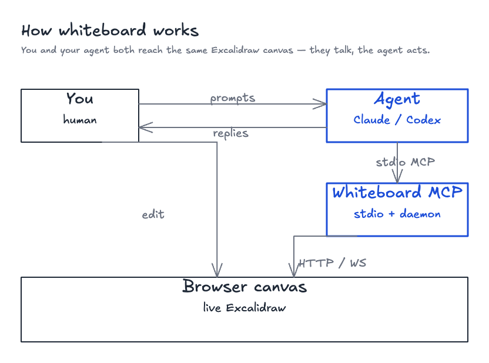

# Architecture

  
   
  <i>Source: <a href="../assets/architecture.excalidraw">architecture.excalidraw</a> — open in Excalidraw to remix.</i>

This project is split into three main runtime layers:

1. A `stdio` MCP server that tools like Claude Code and Codex connect to.
2. A local daemon that serves HTTP and WebSocket endpoints on loopback.
3. A browser canvas built with React, Excalidraw, and Loro-backed synchronization.

## Main components

- **stdio MCP server**
  - Entry point: `dist/server/mcp/index.js`
  - Registers tools, prompts, and resources
  - Talks to the daemon over local HTTP
- **daemon**
  - Entry point: `dist/server/index.js --daemon`
  - Serves `/api/*`, `/mcp`, static app assets, and WebSocket updates
  - Owns token-gated local HTTP transport and runtime lifecycle
- **browser canvas**
  - React + Excalidraw app under `dist/app`
  - Connects to the daemon over WebSocket
  - Applies remote updates and emits local edits
- **storage**
  - Lives under `~/.whiteboard/{workspaceId}/`
  - Stores canvas state, branches, versions, exports, and library metadata

## Data flow

### MCP tool call path

1. Claude Code or Codex sends a tool call to the `stdio` MCP server.
2. The MCP server resolves the current workspace and calls daemon HTTP routes.
3. The daemon updates persistent state or forwards browser-dependent work.
4. The MCP server returns structured JSON back to the MCP client.

### Browser collaboration path

1. A browser opens `/canvas/{workspaceId}/{slug}`.
2. The app loads the current canvas snapshot from the daemon.
3. Local edits update the in-memory document and are persisted through daemon routes.
4. WebSocket events broadcast document changes, version events, and branch head changes.

## MCP tool surface

The MCP server exposes a small, opinionated set of tools that match the canvas lifecycle.

| Tool | Purpose |
|---|---|
| `canvas_create` / `canvas_list` / `canvas_inspect` / `canvas_open` | Canvas lifecycle. `canvas_open` supports `fullscreen: true` to hide the sidebar. |
| `template_list` / `template_insert` | List and insert built-in template fragments. `template_insert` expands through `annotate_batch`, so inserted elements remain normally editable. See [templates](../reference/templates.md). |
| `annotate` / `annotate_batch` | Add elements, single-shot or batched with grid layout. |
| `update_element` / `delete_element` / `move_elements` / `canvas_clear` | Edit elements. |
| `viewport_set` | Control browser pan and zoom (`mode: "fit"` / `"move"`). |
| `export_png` | Export PNG. On success it also returns `imageBase64` as MCP `ImageContent` to the LLM. |
| `canvas_export_json` | Export in standard `.excalidraw` JSON format for round-tripping with Excalidraw desktop or excalidraw.com. |
| `version_save` / `version_restore` / `version_list` | Save and restore labeled canvas versions. `version_restore` accepts an optional `targetSlug` to fork the past state into a new canvas instead of reconciling in place. |
| `load_image` | Import an external image into the canvas. |

`viewport_set` and `export_png` send instructions to the browser over WebSocket and settle on ACK, which is why they need a connected canvas tab. See [wire-protocol](../contributing/architecture/wire-protocol.md) for the full WebSocket message shapes.

## Why Loro

Loro is the CRDT layer used to keep whiteboard state mergeable and replayable.

- It supports incremental updates for collaboration flows.
- It supports snapshot export for persistence and restore.
- It works well with versioning, branching, and version restore.

## Design boundaries

- The MCP layer owns tool contracts and host-facing integration.
- The daemon owns local HTTP transport, persistence, and browser coordination.
- The browser owns rendering, direct manipulation, and user-visible canvas state.

This separation keeps packaged `stdio` distribution simple while still allowing HTTP-first local development and future remote-ready MCP work.
