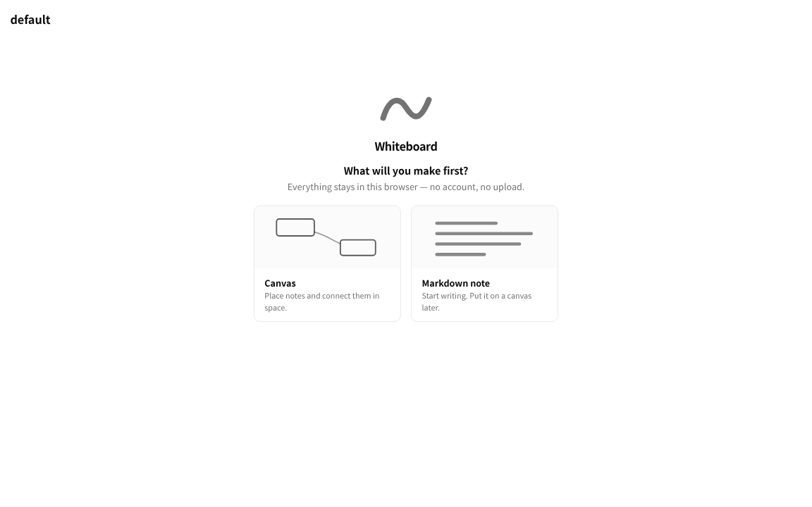
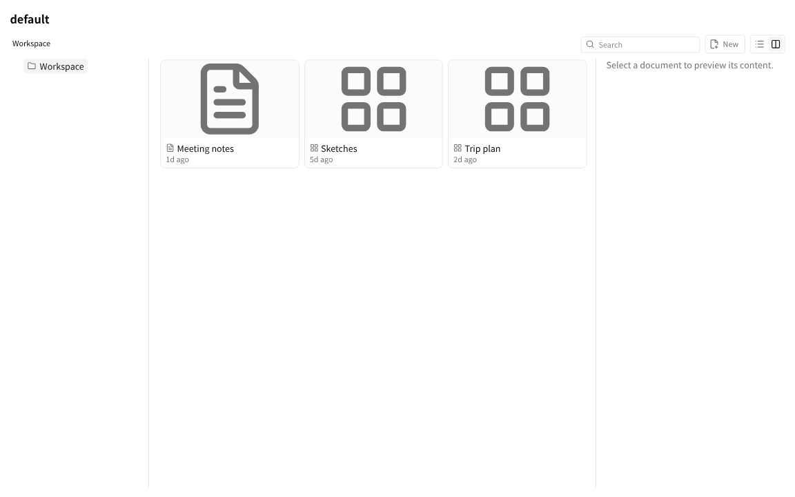

# Getting started

whiteboard's canvas runs right in your browser. When the **browser** is the
keeper, your
drawings live in your own browser (IndexedDB) — no account, and nothing leaves
your machine while you work.

Today you run the browser app locally from a checkout. **Prerequisites:** Node.js
and pnpm (run `corepack enable` if you don't already have pnpm).

```bash
git clone https://github.com/kamiazya/whiteboard.git
cd whiteboard      # pnpm workspace root — required for catalog: dependency resolution
pnpm install
pnpm --filter @kamiazya/whiteboard-web dev   # open http://localhost:5173
```

On a fresh browser the page asks what you'll make first — pick **Canvas**
(notes you place and connect in space) or **Markdown note** (start writing;
you can put it on a canvas later) and it opens ready to work in.



Once you have documents, the page lands on your document browser: a folder
tree with a preview pane. Click a card to preview it, **Open** to edit it,
and use the toolbar to search everything or move a document to a new path.

**New** in that toolbar opens the same two choices — **Canvas** or **Markdown
note** — and creates one in whichever folder you are standing in. A kind
cannot be changed later, which is why you pick it by name rather than by
icon; everything else about a document is editable afterwards, so nothing
else is asked for. If you already know what the document is called and where
it goes, **Name and location…** in that menu takes both up front; leaving its
form untouched creates exactly what the plain entries would have.

Either way the new document opens straight away, ready to work in. The folder
you are standing in is part of the address — the URL carries a `?folder=`
while you are inside one — so coming back lands you where you were, a reload
keeps your place, and a link you paste to someone opens the folder you meant.
The column layout is not in the link: that is a per-browser preference, so
your choice is remembered here without being imposed on whoever you send it
to.



A fresh canvas starts empty. Double-click empty canvas space to make a note
and start typing immediately, or open the **+** menu in the bottom dock: tap
an entry to place it in the middle of the view, or drag one onto the canvas
to drop it exactly where you want it. In **Select** mode, right-clicking
(long-pressing on touch) empty space offers the same creations, placed where
you pressed — Hand mode is navigation only, so it deliberately leaves the
right-click menu closed. The
browser UI also selects, moves, resizes, connects, and edits existing nodes,
and deletes the selected node with Delete/Backspace (disabled while you're
typing in its text editor, so Backspace edits text instead of deleting the
note). Reload the tab after any of these edits and the change is still
there — that's your canvas persisting to IndexedDB in your own browser, with
no server and no account.

**Where to go next:** want your AI agent (Claude Code, Codex, Gemini) to draw with
you, or durable canvases as files on disk? That's the **Local daemon** — see
[Quick install](../../README.md#quick-install). Curious how whiteboard scales from a
browser tab to a self-hosted team server? See [the runtime modes](../explanation/).

← Back to [documentation home](../)
